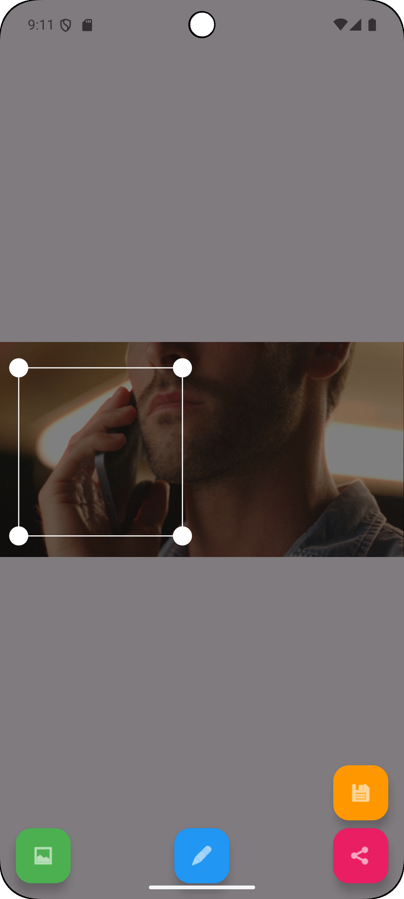

# DustyCV

<p align="center">
  
</p>

## Overview
DustyCV is an Android application that provides advanced image editing capabilities using OpenCV. The app allows users to apply various image processing effects and transformations to their photos.

## Features
- **Image Editing**: Apply various filters and effects to your photos
- **Halation Simulation**: Create beautiful light diffusion effects
- **Crop & Transform**: Basic image manipulation tools
- **OpenCV Integration**: Powered by OpenCV 4.11.0 for advanced image processing

## Screenshots
<p align="center">
  
  
  
  
</p>

### Halation Effect Example
<p align="center">
  
</p>

## Development Setup

### Prerequisites
- Android Studio or your preferred IDE
- Android SDK
- OpenCV 4.11.0 Android SDK

### Installation Steps
1. Download OpenCV SDK:
```bash
wget https://github.com/opencv/opencv/releases/download/4.11.0/opencv-4.11.0-android-sdk.zip
unzip opencv-4.11.0-android-sdk.zip -d ./DustyCV2/opencv
```

2. Import the project in Android Studio:
   - Open Android Studio
   - Select "Open an existing project"
   - Navigate to and select the DustyCV2 directory
